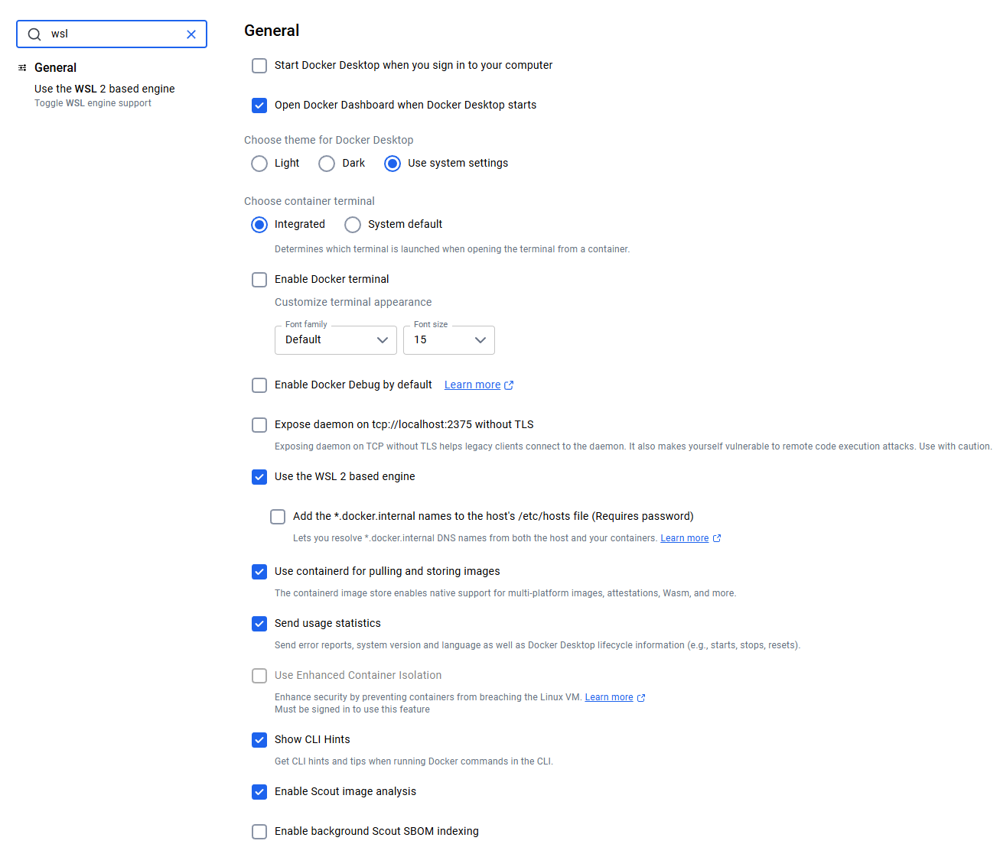
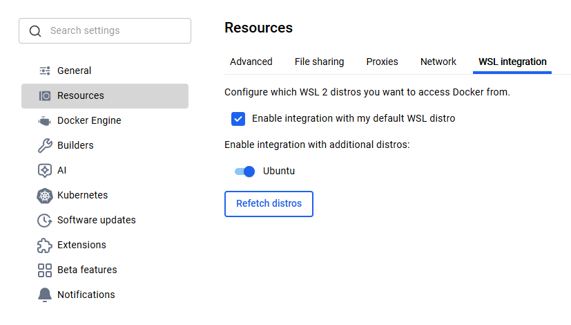

# MuJoCo Desktop Environment avec GPU NVIDIA

Guide d'installation et d'utilisation de l'environnement MuJoCo avec support GPU pour l'apprentissage par renforcement.


## Prérequis

- Windows 10/11 (version 21H2 ou supérieure)
- GPU NVIDIA avec drivers installés
- 8 GB RAM minimum (16 GB recommandé)

## Installation

### 1. Installer WSL2 (Windows Subsystem for Linux)

**Important** : WSL2 doit être installé **avant** Docker Desktop.

Ouvrir **PowerShell en administrateur** et exécuter :

```powershell
wsl --install
wsl --update
```

Redémarrer l'ordinateur si demandé.

### 2. Premier lancement de WSL

Dans PowerShell (pas besoin d'admin) :

```powershell
wsl
```

Au premier lancement, WSL vous demandera :
- Un **nom d'utilisateur**
- Un **mot de passe** (à retenir !)

### 3. Installer Docker Desktop

1. Télécharger Docker Desktop pour Windows : https://desktop.docker.com/win/main/amd64/Docker%20Desktop%20Installer.exe
2. Exécuter l'installateur `.exe`
3. Suivre les instructions d'installation (Docker détectera automatiquement WSL2)
4. Redémarrer l'ordinateur si demandé
5. Lancer Docker Desktop

### 4. Configurer Docker Desktop pour WSL2

1. Ouvrir **Docker Desktop**

2. **Vérifier l'intégration WSL2 dans General :**
   - Aller dans **Settings → General**
   - Vérifier que **"Use the WSL 2 based engine"** est coché
   
   

3. **Activer l'intégration avec votre distribution WSL :**
   - Aller dans **Settings → Resources → WSL Integration**
   - Activer :
     - ✅ "Enable integration with my default WSL distro"
     - ✅ Votre distribution Ubuntu (ou le nom de votre distro)
   
   

4. Cliquer sur **"Apply & Restart"**

5. **Vérifier que l'intégration est bien active** après le redémarrage :
   - Retourner dans **Settings → Resources → WSL Integration**
   - Confirmer que les cases sont toujours cochées

### 4. Vérifier l'installation GPU dans WSL

Dans WSL (taper `wsl` dans PowerShell) :

```bash
nvidia-smi
```

Vous devriez voir les informations de votre GPU NVIDIA.

Sinon installer les drivers :

https://www.nvidia.com/en-us/drivers/

Tester Docker avec GPU :

```bash
docker run --rm --gpus all nvidia/cuda:12.0.0-base-ubuntu22.04 nvidia-smi
```


## Lancement de l'environnement

---

## PARTIE 1 : Lancement via WSL (Recommandé pour GPU)

### Commande de lancement :

Ouvrir PowerShell et lancer WSL :

```powershell
wsl
```

Puis dans WSL dans le dossier avec le start.sh:

Par exemple :
```bash
cd /mnt/c/Users/VOTRE_USERNAME/Document/appr_renf
./start.sh
```

### Dossier partagé :

**Linux (WSL)** ↔️ **Docker**
```
/home/VOTRE_USERNAME/rl/mujoco/workspace  ←→  /home/student/workspace
```

### 💻 Éditer les fichiers depuis Windows :

```
\\wsl.localhost\Ubuntu\home\VOTRE_USERNAME\rl\mujoco\workspace
```


### ✅ Avantages :
- GPU CUDA fonctionnel (PyTorch/TensorFlow)
- Jupyter fonctionne correctement
- Meilleure détection GPU
- Performance optimale pour l'entraînement

### Inconvénients :
- Dossier différent du lancement Windows
- Nécessite d'ouvrir WSL

### 🌐 Accès :
- Desktop: http://localhost:6080
- Jupyter: http://localhost:8888

---

## PARTIE 2 : Lancement direct depuis Windows

### Commande de lancement :

Double-cliquer sur `start.bat` ou dans PowerShell :

```powershell
cd C:\Users\VOTRE_USERNAME\Documents\appr_renf
.\start.bat
```

### Dossier partagé :

**Windows** ↔️ **Docker**
```
C:\Users\VOTRE_USERNAME\rl\mujoco\workspace  ←→  /home/student/workspace
```

### 💻 Éditer les fichiers depuis Windows :

**VSCode directement :**
```
Ouvrir le dossier : C:\Users\VOTRE_USERNAME\rl\mujoco\workspace
```

**Explorateur Windows :**
```
C:\Users\VOTRE_USERNAME\rl\mujoco\workspace
```

### ✅ Avantages :
- Simple, un double-clic sur start.bat
- Dossier Windows natif (facile d'accès)
- Pas besoin d'ouvrir WSL

### Inconvénients :
- GPU CUDA peut ne pas fonctionner (détection moins fiable)
- Jupyter peut avoir des problèmes de permissions
- Software rendering pour OpenGL

### 🌐 Accès :
- Desktop: http://localhost:6080
- Jupyter: http://localhost:8888 (peut ne pas démarrer)

---

## Comparaison rapide :

| Critère | WSL (start.sh) | Windows (start.bat) |
|---------|----------------|---------------------|
| GPU CUDA | ✅ Fonctionne | ❌ Peut échouer |
| Jupyter | ✅ Fonctionne | ⚠️ Problèmes possibles |
| Dossier partagé | `/home/USERNAME/...` | `C:\Users\USERNAME\...` |
| Simplicité | ⚠️ Terminal WSL | ✅ Double-clic |
| Performance | ✅ Optimale | ⚠️ Moyenne |

---


## Accès à l'environnement

Une fois lancé, ouvrir dans votre navigateur :

- **Desktop noVNC** : http://localhost:6080
- **Jupyter Notebook** : http://localhost:8888


## Vérifier le support GPU

Dans Jupyter (http://localhost:8888), créer un nouveau notebook et tester :

```python
import torch

device = torch.device("cuda:0" if torch.cuda.is_available() else "cpu")
print(f"Device: {device}")

if torch.cuda.is_available():
    print(f"GPU: {torch.cuda.get_device_name(0)}")
    print(f"CUDA Version: {torch.version.cuda}")
else:
    print("No GPU available")
```

Résultat attendu :
```
Device: cuda:0
GPU: NVIDIA GeForce RTX 4090
CUDA Version: 1x.x
```

## Arrêter l'environnement

Dans le terminal où l'environnement tourne :

```
Ctrl+C
```

Le conteneur s'arrêtera proprement.

## Options de lancement

### Résolution personnalisée

```bash
./start.sh --resolution 2560x1440
```

### Mode économie de RAM

```bash
./start.sh --small_ram
```

### RAM personnalisée

```bash
./start.sh --ram 2g
```

### Qualité d'affichage

```bash
./start.sh --quality medium  # ou low
```

### Mode local (sans vérifier les mises à jour)

```bash
./start.sh --local
```

## Support CUDA vs OpenGL

### ✅ CUDA (Calculs GPU)
- PyTorch, TensorFlow
- Entraînement de réseaux de neurones
- **Fonctionne avec ce setup**

### OpenGL (Affichage 3D)
- Visualisation MuJoCo
- Software rendering (CPU)
- Légèrement plus lent mais fonctionnel

**Note** : L'entraînement RL utilise principalement CUDA (rapide), l'affichage 3D est surtout pour la visualisation/debug.

## Ressources

- MuJoCo : https://mujoco.org/
- Docker Desktop : https://www.docker.com/products/docker-desktop
- WSL Documentation : https://docs.microsoft.com/windows/wsl/
